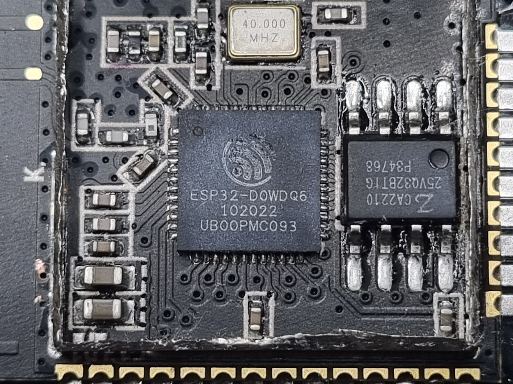

# mini-morserino
Stripped down version of the Morserino hardware, for use with a Hailege ESP32 board

The Hailege board (now distributed by hiletgo.com),
uses an ESP-32-WROOM module.



Inside, we find an old ESP32-DOWDQ6 with the following
specifications:

* Ordering code: ESP32-D0WDQ6 (NRND)
* Cores: Dual core
* Chip revision: v1.0/v1.1
* Embedded flash/SRAM: no
* Package: QFN 6*6
* VDD_SDIO voltage: 1.8 V/3.3 V


There is also a Flash RAM 25VQ32BTIG, which seems to be a compatible
type to T25Q32BTEGT or HM25Q128A.

## OLED display

From the ESP32, the GPIO pins 4 and 5 have a direct connection
to the OLED display. The assignment is

```
GPIO5 <-> Display, Pin 17
GPIO4 <-> Display, Pin 18
```

I2C address is (probably) 0x3C.

## Gotchas

Gotcha #1. You must press and hold the BOOT button for a few seconds when Arduino or Pio starts to program. Workaround: solder 1.0uF cap from pin 3 (EN) on the module to pin 1 (GND).

Gotcha #2. OLED uses gpio 4 and 5 for I2C. Do not use these for other purposes else your display will not work.

Gotcha #3. GPIO12 (Pin MTDI) must be logic low on power up or else micro won't boot up.

Gotcha #4. GPIO0 must be logic HIGH on power up or else micro won't boot up.
