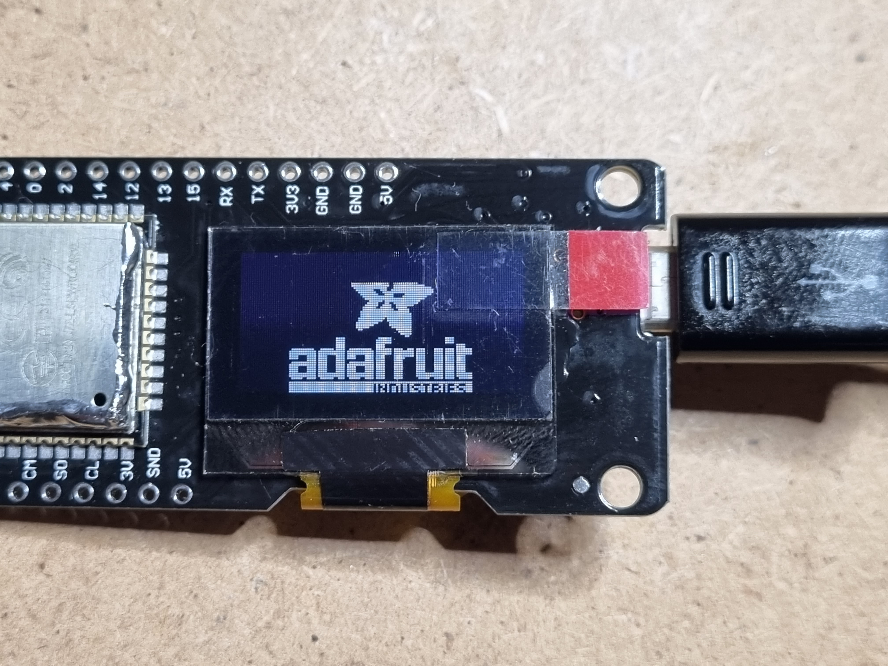
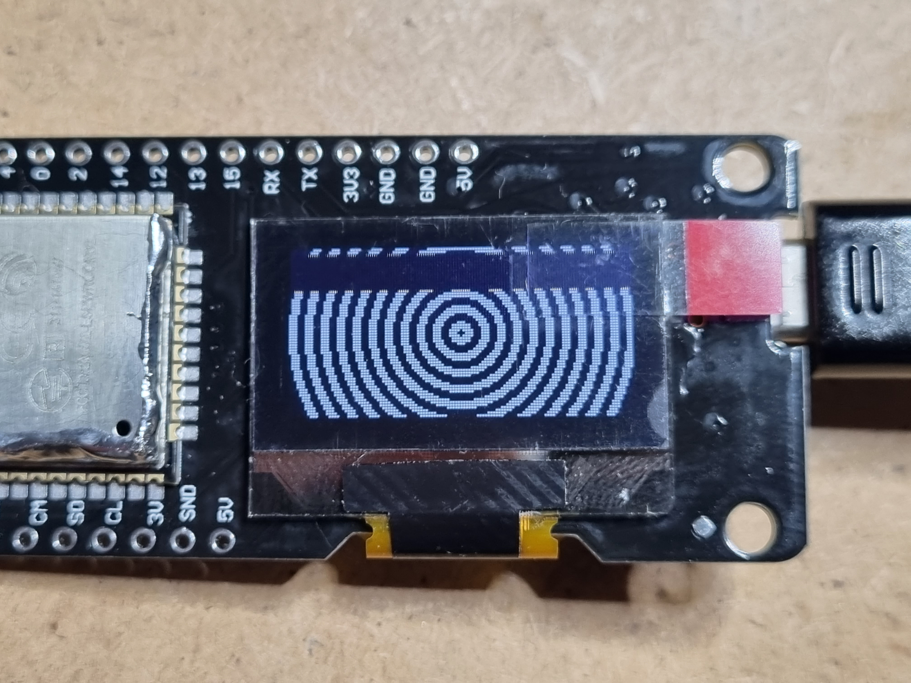

# mini-morserino
Stripped down version of the Morserino hardware, for use with a Hailege ESP32 OLED board

**DISCLAIMER**: You are currently on a special branch for this project, where I keep
basic infos about the used Hailege board and how to get the OLED display going. If
you're interested in the actual project, switch to the 'main' branch instead, please! 

## The board

The Hailege board '0.96" ESP32 OLED ESP-WROOM-32 ESP32 ESP-32' (H-1-1290, was available
on Amazon at https://www.amazon.de/dp/B07YKLSKG6, now distributed by hiletgo.com),
uses an ESP-32-WROOM module.

Inside, we find an old ESP32-DOWDQ6 with the following
specifications:

* Ordering code: ESP32-D0WDQ6 (NRND)
* Cores: Dual core
* Chip revision: v1.0/v1.1
* Embedded flash/SRAM: no
* Package: QFN 6*6
* VDD_SDIO voltage: 1.8 V/3.3 V

There is also a Flash RAM 25VQ32BTIG, which seems to be a compatible
type to T25Q32BTEGT or HM25Q128A.

The board itself is very similar to the "Wemos Lolin32" (see also https://randomnerdtutorials.com/esp32-built-in-oled-ssd1306/)

## GPIO pins

| ESP32 Name | ESP32 Pin # | Pin type | Board Silkscreen | Function |
| ---------- | ----------- | -------- | ---------------- | -------- |
| SENSOR_VP | 5 | I | SVP | GPIO36, ADC1_CH0, RTC_GPIO0 |
| GPIO25 | 14 | I/O | 25 | GPIO25, ADC2_CH8, RTC_GPIO6, DAC_1, EMAC_RXD0 |
| GPIO26 | 15 | I/O | 26 | GPIO26, ADC2_CH9, RTC_GPIO7, DAC_2, EMAC_RXD1 |
| SD_DATA_1 | 33 | I/O | S1 | GPIO8, HS1_DATA1, U2CTS, SD_DATA1, SPID |
| SD_CMD | 30 | I/O | CM | GPIO11, HS1_CMD, U1RTS, SD_CMD, SPICS0 |
| SD_DATA_0 | 32 | I/O | SO | GPIO7, HS1_DATA0, U2RTS, SD_DATA0, SPIQ |
| SD_CLK | 31 | I/O | CL | GPIO6, HS1_CLK, U1CTS, SD_CLK, SPICLK |
| SENSOR_VN | 8 | I | SVN | GPIO39, ADC1_CH3, RTC_GPIO3 |
| GPIO16 | 25 | I/O | 16 | GPIO16, HS1_DATA4, U2RXD, EMAC_CLK_OUT |
| GPIO5 | 34 | I/O | 5 | GPIO5, I2C_SDA, HS1_DATA6, VSPICS0, EMAC_RX_CLK |
| GPIO4 | 24 | I/O | 4 | GPIO4, I2C_SCLK, ADC2_CH0, RTC_GPIO10, TOUCH0, EMAC_TX_ER, HSPIHD, HS2_DATA1, SD_DATA1 |
| GPIO0 | 23 | I/O | 0 | GPIO0, ADC2_CH1, RTC_GPIO11, TOUCH1, EMAC_TX_CLK, CLK_OUT1 |
| GPIO2 | 22 | I/O | 2 | GPIO2, ADC2_CH2, RTC_GPIO12, TOUCH2, HSPIWP, HS2_DATA0, SD_DATA0 |
| MTMS | 17 | I/O | 14 | GPIO14, ADC2_CH6, RTC_GPIO16, TOUCH6, EMAC_TXD2, HSPICLK, HS2_CLK, SD_CLK, MTMS |
| MTDI | 18 | I/O | 12 | GPIO12, ADC2_CH5, RTC_GPIO15, TOUCH5, EMAC_TXD3, HSPIQ, HS2_DATA2, SD_DATA2, MTDI |
| MTCK | 20 | I/O | 13 | GPIO13, ADC2_CH4, RTC_GPIO14, TOUCH4, EMAC_RX_ER, HSPID, HS2_DATA3, SD_DATA3, MTCK |
| MTDO | 21 | I/O | 15 | GPIO15, ADC2_CH3, RTC_GPIO13, TOUCH3, EMAC_RXD3, HSPICS0, HS2_CMD, SD_CMD, MTDO |
| U0RXD | 40 | I/O | RX | GPIO3, U0RXD, CLK_OUT2 |
| U0TXD | 41 | I/O | TX | GPIO1, U0TXD, CLK_OUT3, EMAC_RXD2 |

## OLED display

From the ESP32, the GPIO pins 4 (I2C_SCLK) and 5 (I2C_SDAT) have a direct connection
to the OLED display. The PIN assignment for the OLED display itself seems to follow
the datasheet of a Vishay OLED-128O064D-BPP3N00000 (https://www.vishay.com/product/37902/).

The I2C address is 0x3C.

When using these values, as is demonstrated in the SSD1306 demo shield, the display is
running fine. For uploading the program from the Arduino IDE to the board, the type
"Wemos Lolin32" can be selected. Also regard the various "gotchas" as listed in the
next section.

If everything is right, you should be greeted with the display demo on your OLED now.

## Gotchas

Gotcha #1. You must press and hold the BOOT button for a few seconds when Arduino or Pio starts to program. Workaround: solder 1.0uF cap from pin 3 (EN) on the module to pin 1 (GND).

Gotcha #2. OLED uses the pins GPIO4 and GPIO5 for I2C. Do not use these for other purposes, else your display will not work.

Gotcha #3. GPIO12 (Pin MTDI) must be logic low on power up or else micro won't boot up. (This is already the case with this Hailege board)

Gotcha #4. GPIO0 must be logic HIGH on power up or else micro won't boot up. (This is already the case with this Hailege board)
